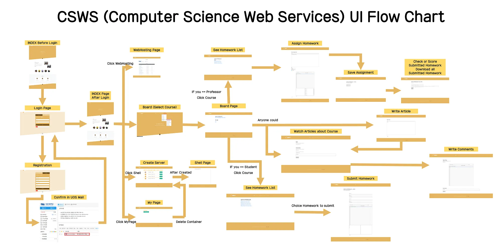

무조건 repo에 update 있을 때마다 해주셔야 합니다.\
container 내부에서 vi로 소스 바꿔도 내 로컬에는 적용되지 않습니다.\
마찬가지로 내 로컬에서 소스 바꿔도 container 내부에는 적용되지 않습니다.\
내 로컬에서 소스를 바꿀 시에는 항상 1번(image build)부터 다시 해주셔야 합니다.\
제일 처음에 빌드할 때 server_b:1.0으로 빌드해 주시고, 그 다음부터는 1.1로 빌드해주시면 캐시때문에 빠른 빌드 가능합니다.\

 
 

>  ########### 아래는 local bash ###########

# 1. image build
build 하면서 update된(pull로 가져오거나 내가 수정한) web_backend 폴더와 내부 파일들을 생성된 container 내부에 넣어줍니다.\
`docker build -t server_b:1.0 .`

# 2. container 생성
`docker run -it -d -p 8000:8000 --privileged=true --name test server_b:1.0`

# 3. container 진입
`docker exec -it test bash`

 
 

>  ########### 아래는 container bash ###########

# 4. db 생성
`systemctl start mariadb.service`\
`echo "create database db_server_b; grant all privileges on db_server_b.* to 'admin'@'localhost' identified by '1234';" | mysql -u root`

# 5. db migrate
`cd /app`\
`python3 manage.py makemigrations accounts`\
`python3 manage.py migrate accounts`\
`python3 manage.py migrate`\
`python3 manage.py makemigrations shell`\
`python3 manage.py makemigrations web_hosting`\
`python3 manage.py makemigrations boards`\
`python3 manage.py migrate`\

# 6. superuser(admin 페이지 접속용) 만들기 
`python3 manage.py createsuperuser`\
name 입력할 때 영어로 입력해주세요.

# 7. 내 로컬 웹브라우저에서 확인
`python3 manage.py runserver 0.0.0.0:8000 &`\
http://0.0.0.0:8000/ \
http://0.0.0.0:8000/admin/

# 8. background에서 실행중인 서버 죽이는 방법
실행중인 프로세스 확인\
`jobs`\
ex) [1]+  Running                 python3 manage.py runserver 0.0.0.0:8000 & \
`kill -9 %1`

# 9. 도커 관련 명령어들
도커 컨테이너 죽이기\
`docker kill test1`\
 
도커 컨테이너 삭제\
`docker remove test1`\
 
도커 이미지 삭제\
`docker image rm server_b:1.1`\
  
